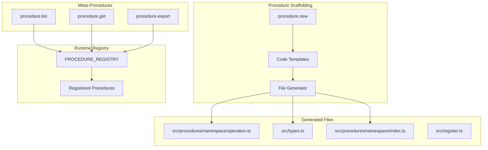
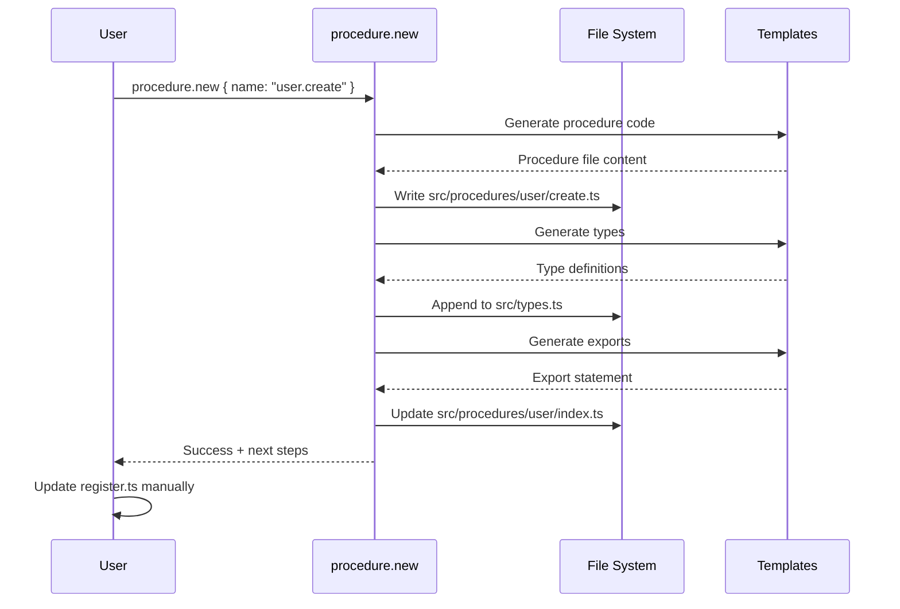

# @mark1russell7/client-procedure

[](https://www.npmjs.com/package/@mark1russell7/client-procedure)
[](https://opensource.org/licenses/MIT)
[](https://www.typescriptlang.org/)

**Procedure scaffolding and meta-procedures for runtime procedure management.**

## Table of Contents

- [Overview](#overview)
- [Installation](#installation)
- [Architecture](#architecture)
- [Quick Start](#quick-start)
- [API Reference](#api-reference)
- [Examples](#examples)
- [Integration](#integration)

## Overview

`@mark1russell7/client-procedure` provides utilities for creating and managing procedures:

- **procedure.new**: Scaffold new procedures with types and registration boilerplate
- **procedure.list**: List all registered procedures in the runtime registry
- **procedure.get**: Get metadata for a specific procedure
- **procedure.export**: Export procedure definitions as JSON

This package simplifies procedure development by automating the creation of procedure files, type definitions, and registration code.

## Installation

```bash
npm install github:mark1russell7/client-procedure#main
```

**Dependencies:**
- `@mark1russell7/client` (peer dependency)
- `zod` ^3.24.0

## Architecture



### Scaffolding Flow



## Quick Start

```typescript
import { Client } from "@mark1russell7/client";
import "@mark1russell7/client-procedure/register";

const client = new Client({ /* transport */ });

// Scaffold a new procedure
const result = await client.call(["procedure", "new"], {
  name: "user.create",
  description: "Create a new user account",
});

console.log(result.operations);
// [
//   "Creating directory: /project/src/procedures/user",
//   "Creating procedure file: /project/src/procedures/user/create.ts",
//   "Creating index: /project/src/procedures/user/index.ts",
//   "Appending types to: /project/src/types.ts",
//   "Next steps: ..."
// ]
```

## API Reference

### Procedures

#### `procedure.new`

Scaffold a new procedure with type definitions and boilerplate.

```typescript
interface ProcedureNewInput {
  name: string;              // Dot-notation name (e.g., "user.create")
  namespace?: string;        // Namespace override (defaults to first segment)
  description?: string;      // Procedure description
  path?: string;             // Project path (defaults to cwd)
  dryRun?: boolean;          // Preview without creating files
}

interface ProcedureNewOutput {
  success: boolean;
  procedurePath: string[];   // e.g., ["user", "create"]
  created: string[];         // Files created
  modified: string[];        // Files modified
  operations: string[];      // Operations performed
  errors: string[];          // Any errors
}
```

**Example:**
```typescript
const result = await client.call(["procedure", "new"], {
  name: "user.create",
  description: "Create a new user",
  path: "/path/to/package",
});
```

**Generated Files:**

1. **Procedure File** (`src/procedures/user/create.ts`):
```typescript
/**
 * user.create procedure
 *
 * Create a new user
 */

import type { UserCreateInput, UserCreateOutput } from "../../types.js";

/**
 * Create a new user
 */
export async function userCreate(input: UserCreateInput): Promise<UserCreateOutput> {
  // TODO: Implement user.create procedure
  return {
    success: true,
    message: "Hello from user.create",
  };
}
```

2. **Type Definitions** (appended to `src/types.ts`):
```typescript
// =============================================================================
// user.create Types - Create a new user
// =============================================================================

export const UserCreateInputSchema: z.ZodObject<{
  // TODO: Add input fields
}> = z.object({
  // TODO: Add input fields
});

export type UserCreateInput = z.infer<typeof UserCreateInputSchema>;

export interface UserCreateOutput {
  /** Whether the operation succeeded */
  success: boolean;
  /** Response message */
  message: string;
}
```

3. **Index Export** (appended to `src/procedures/user/index.ts`):
```typescript
export { userCreate } from "./create.js";
```

4. **Next Steps** (printed in operations):
```typescript
Next steps:
1. Implement the procedure logic in src/procedures/user/create.ts
2. Add registration to register.ts:

   import { userCreate } from "./procedures/user/create.js";
   import { UserCreateInputSchema, type UserCreateInput, type UserCreateOutput } from "./types.js";

   const userCreateInputSchema = zodAdapter<UserCreateInput>(UserCreateInputSchema);
   const userCreateOutputSchema = outputSchema<UserCreateOutput>();

   const userCreateProcedure = createProcedure()
     .path(["user", "create"])
     .input(userCreateInputSchema)
     .output(userCreateOutputSchema)
     .meta({
       description: "Create a new user",
       args: [],
       shorts: {},
       output: "text",
     })
     .handler(async (input: UserCreateInput): Promise<UserCreateOutput> => {
       return userCreate(input);
     })
     .build();

   // Add to registerProcedures array
```

#### `procedure.list`

List all registered procedures in the runtime registry.

```typescript
interface ProcedureListInput {
  namespace?: string;    // Filter by namespace
  pattern?: string;      // Filter by path pattern
}

interface ProcedureListOutput {
  procedures: Array<{
    path: string[];
    metadata?: Record<string, unknown>;
  }>;
  count: number;
}
```

**Example:**
```typescript
const { procedures } = await client.call(["procedure", "list"], {
  namespace: "git",
});
// {
//   procedures: [
//     { path: ["git", "add"], metadata: { description: "..." } },
//     { path: ["git", "commit"], metadata: { description: "..." } },
//     ...
//   ],
//   count: 15
// }
```

#### `procedure.get`

Get metadata for a specific procedure.

```typescript
interface ProcedureGetInput {
  path: string[];        // Procedure path
}

interface ProcedureGetOutput {
  procedure: {
    path: string[];
    metadata?: Record<string, unknown>;
    hasHandler: boolean;
  } | null;
}
```

**Example:**
```typescript
const { procedure } = await client.call(["procedure", "get"], {
  path: ["git", "commit"],
});
```

#### `procedure.export`

Export procedure definitions as JSON (for serialization/storage).

```typescript
interface ProcedureExportInput {
  paths?: string[][];    // Specific procedures to export (defaults to all)
  includeHandlers?: boolean;  // Include handler code (default: false)
}

interface ProcedureExportOutput {
  procedures: Array<{
    path: string[];
    input: object;       // JSON schema
    output: object;      // JSON schema
    metadata?: object;
    handler?: string;    // Handler code (if includeHandlers=true)
  }>;
}
```

## Examples

### Scaffold a Nested Procedure

```typescript
// Create a deeply nested procedure
const result = await client.call(["procedure", "new"], {
  name: "api.users.permissions.grant",
  description: "Grant permission to a user",
});

// Generated path: ["api", "users", "permissions", "grant"]
// File: src/procedures/api/users/permissions/grant.ts
```

### Dry Run Mode

```typescript
// Preview what would be created without actually creating files
const preview = await client.call(["procedure", "new"], {
  name: "product.update",
  dryRun: true,
});

console.log(preview.operations);
// [
//   "Would create directory: /project/src/procedures/product",
//   "Would create procedure file: /project/src/procedures/product/update.ts",
//   "Would create/update index: /project/src/procedures/product/index.ts",
//   "Would append types to: /project/src/types.ts",
//   ...
// ]
```

### List Procedures by Namespace

```typescript
// List all git procedures
const { procedures } = await client.call(["procedure", "list"], {
  namespace: "git",
});

for (const proc of procedures) {
  console.log(proc.path.join("."), "-", proc.metadata?.description);
}
// git.add - Stage files for commit
// git.commit - Create a new commit
// git.push - Push commits to remote
// ...
```

### Export Procedures for Storage

```typescript
// Export all procedures as JSON
const { procedures } = await client.call(["procedure", "export"], {
  includeHandlers: false,  // Exclude handler code
});

// Save to file or send to API
await fs.writeFile("procedures.json", JSON.stringify(procedures, null, 2));
```

## Integration

### Use with CLI

The `procedure.new` command is also available via the Mark CLI:

```bash
# Scaffold a new procedure
node cli/dist/index.js procedure new user.create

# With options
node cli/dist/index.js procedure new user.update \
  --description "Update user information" \
  --path /path/to/package \
  --dry-run
```

### Use in Package Development

1. **Create package structure**:
```bash
node cli/dist/index.js lib new my-client-package
cd my-client-package
```

2. **Scaffold procedures**:
```bash
node cli/dist/index.js procedure new myapp.start
node cli/dist/index.js procedure new myapp.stop
node cli/dist/index.js procedure new myapp.status
```

3. **Implement handlers**:
Edit the generated files in `src/procedures/myapp/*.ts`

4. **Register procedures**:
Add registration code to `src/register.ts` (follow the printed instructions)

5. **Build and test**:
```bash
npm run build
npm test
```

## Naming Conventions

Procedure names follow dot-notation:
- **Single segment**: `greet` → `["greet"]`
- **Two segments**: `user.create` → `["user", "create"]`
- **Nested**: `api.users.permissions.grant` → `["api", "users", "permissions", "grant"]`

Generated identifiers:
- **camelCase** for function names: `user.create` → `userCreate`
- **PascalCase** for types: `user.create` → `UserCreate`
- **kebab-case** for files: `user.create` → `create.ts` (in `user/` dir)

## Requirements

- **Node.js**: >= 20
- **TypeScript**: >= 5.0
- **Dependencies**:
  - `@mark1russell7/client` (peer)
  - `zod` ^3.24.0

## License

MIT

## See Also

- `@mark1russell7/client` - Core client/procedure system
- `@mark1russell7/cli` - CLI that uses procedure.new for scaffolding
- Package scaffolding guide in ecosystem documentation
